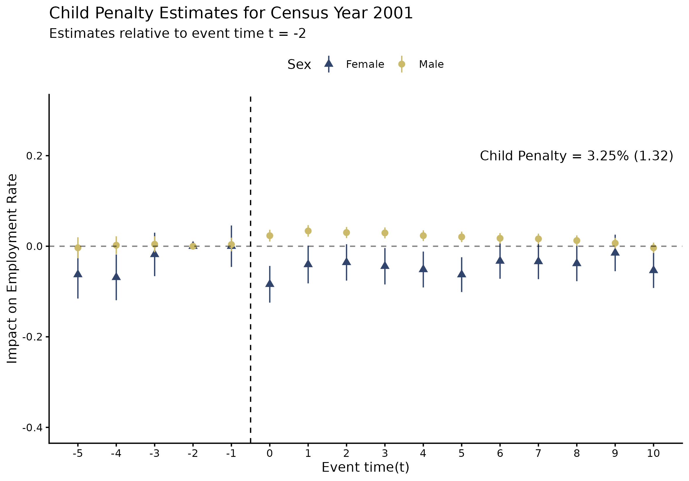
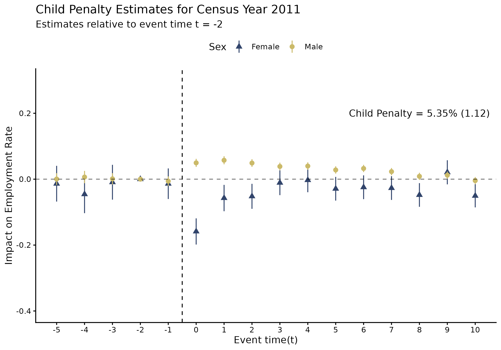
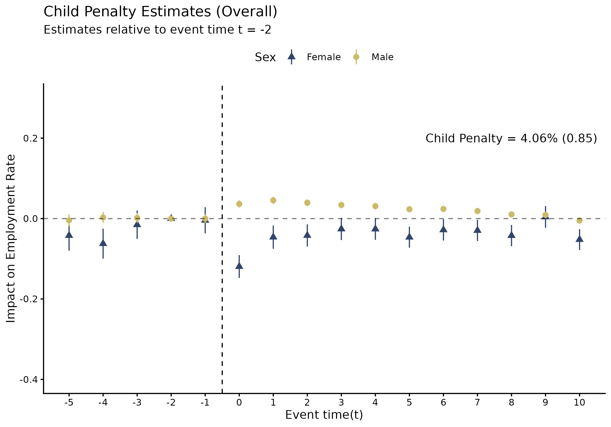
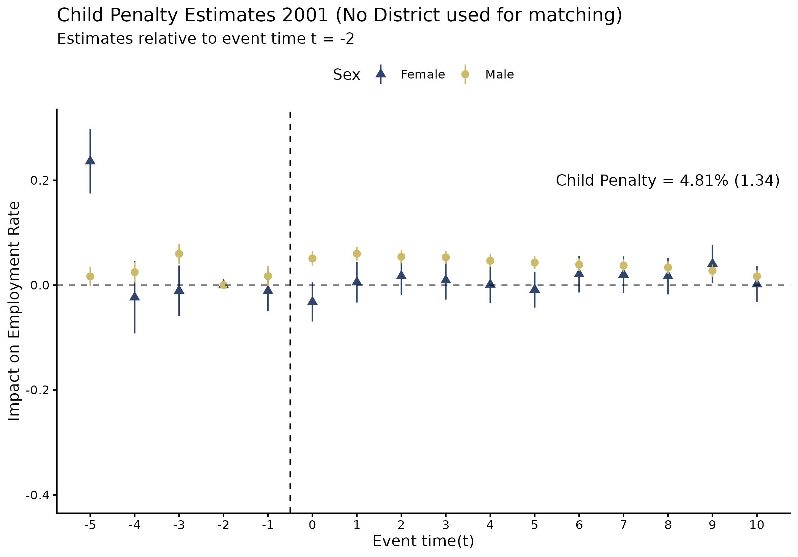
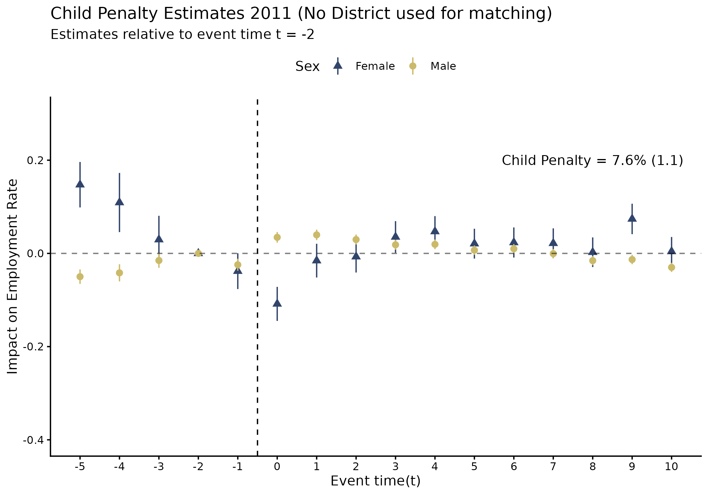
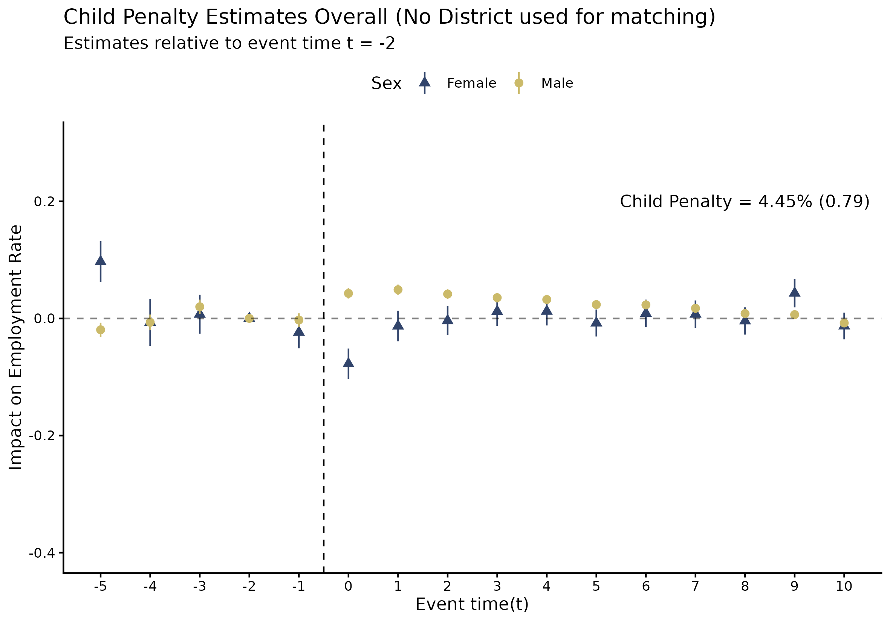

# Introduction

The goal of this blog is to present/replicate the Child Penalty estimates for Nepal from @kleven2025child. While the paper has a specific sample conditioning (which variables they condition their sample on) and matching (which variables they use to perform exact matching, I, ideally, want to show the results for many different permutations and combinations of sample and matching conditioning to see what differs and maybe think about why they differ. 

## Child Penalty Estimates (obtained with exact matching with inclusion of districts)

### Estimates for 2001 A.D.

### Estimates for 2011 A.D.

### Estimates for the Joint Dataset.

## Child Penalty Estimates (obtained with exact matching with exclusion of districts)

### Estimates for 2001 A.D.

### Estimates for 2011 A.D.

### Estimates for the Joint Dataset.
