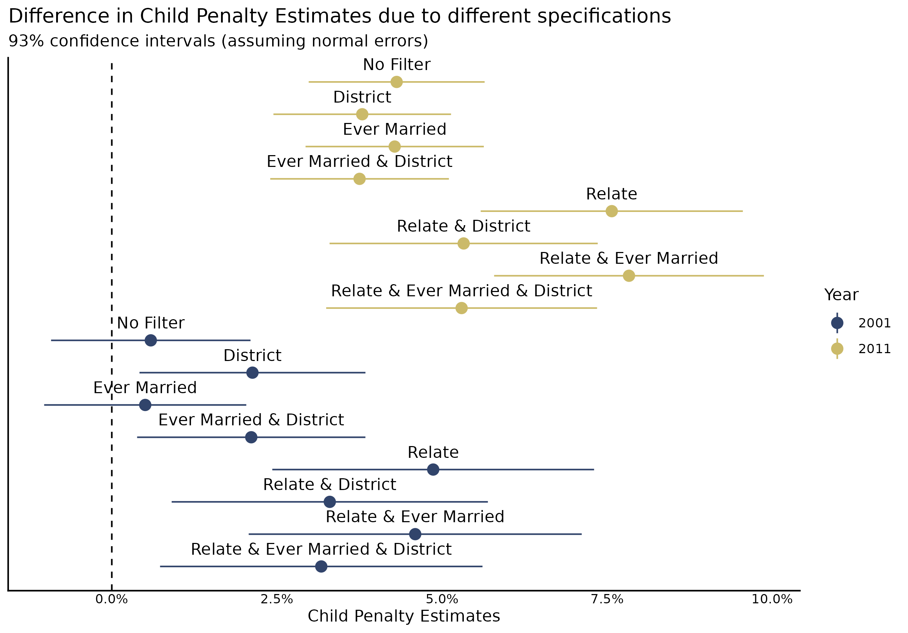
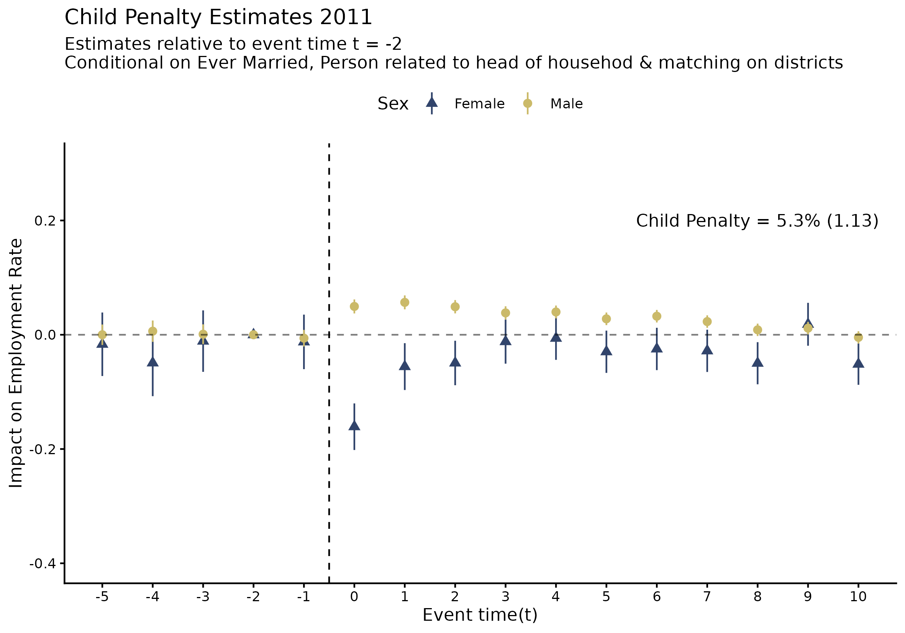

# Introduction

The goal of this blog is to present/replicate the Child Penalty estimates for Nepal from @kleven2025child. While the paper has a specific sample conditioning (which variables they condition their sample on) and matching (which variables they use to perform exact matching) I, ideally, want to show the results for many different permutations of sample and matching conditions to see what differs and maybe think about why they differ. 

::: {#variation-plot}

The following image shows 16 different child penalty estimates (and their 93% confidence intervals). The variation arise from difference in the sample as well as the matching procedures. *Relate* refers to the data being conditional on head of households, their spouse and their child; *Ever Married* refers to data conditional on only those adults who have married (and/or divorced); *District* refers to the use of a person's district of residence as a matching variable.

These permuatations of conditions are additions on some default conditionings i.e. Ages between 15-45, Age of First Child between 20-45, Age of their eldest child <= 10 years old.

:::

## Some specific Plots.

::: {#First-Plot}

:::

